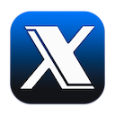

Hey there, tech enthusiasts and fellow Mac users! 👋 If you're anything like me, you probably love your Mac and want it running as smoothly as the day you unboxed it. But let’s face it—over time, things start feeling a little sluggish. That’s where OnyX comes in, and let me tell you, it’s an absolute gem. 💎

I stumbled upon OnyX during one of my late-night internet rabbit holes (you know, the "best free Mac cleaner" kind of search), and honestly, it has been a game-changer. The best part? It’s completely free. No hidden subscriptions, no annoying upsells—just a solid app that does exactly what it promises.

Download OnyX: [Official website](https://www.titanium-software.fr/en/onyx.html)

💡: Make sure to download the right version for your macOS and back up your data before running a cleanup. OnyX is free, reliable, and hands-down one of the best ways to keep your Mac happy.

Stay chill,

ChillCatCoCo 🐾